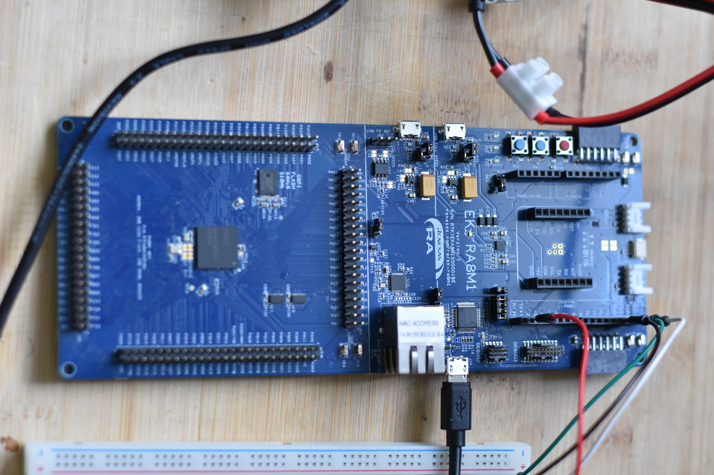
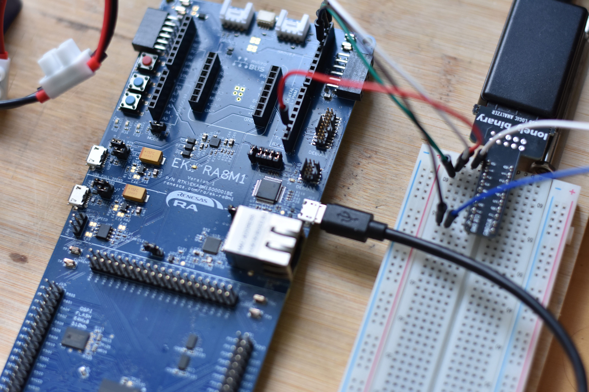
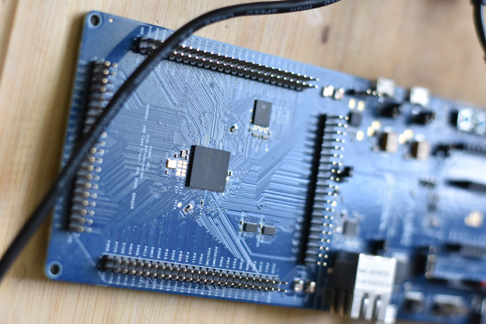
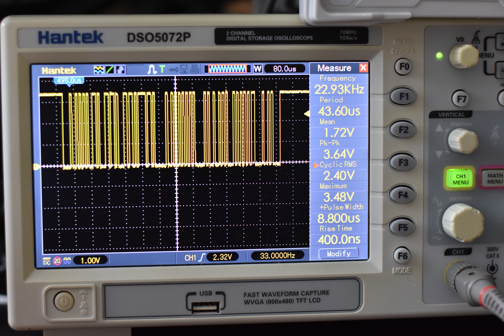

# Embedded_C_ARM_CortexM85_SerialCommunication

## RA8M1 Learning Lab

Personal learning project using the Renesas EK-RA8M1 board.

Current experiments:
- UART
- I2C
- Oscilloscope debugging

## DOCUMENTATION

- [SETUP](docs/setup.md)
- [UART](docs/uart.md)
- [I2C](docs/i2c.md)
- [ARCHITECTURE](docs/setup.md)

